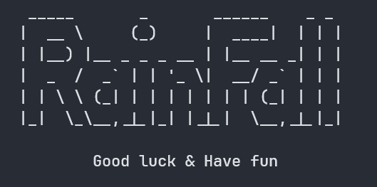

# RainFall

42 project which aims to introduce us to reverse engineering.

RainFall is an iso challenge slightly more complex than SnowCrash. You will have to dive deep into reverse engineering, learn to reconstruct a code, and understand it to detect faults. Will you reach the last level?

Since this is the second project of the security branch, we will be using the knowledge we acquired in the previous project, [SnowCrash](https://github.com/Assxios/SnowCrash).

# Foreword

## Vision
For this project, we tried our absolute best to make our source files as accurate as possible. However we couldn't always have the exact assembly code as the original binary. The following sources whom are not exactly the same as the original binary are:
- [bonus0/source.c](/bonus0/source.c)
- [bonus2/source.c](/bonus2/source.c)
- [bonus3/source.c](/bonus3/source.c)
> Althought the source code is not exactly the same as the original binary, it still works the same way and will allow you to solve the challenge.

If you are able to make the source code more accurate, please feel free to open a pull request.

We, sometimes, provided multiple solutions to a challenge. Simply because we thought it would be interesting to show different ways of solving a challenge. We're aware that we are missing a lot of solutions, but that was not the goal of this project.

## Tools
We **only** used `GDB` for this project.  
We heavily recommend you to stick to reading the assembly code and understanding the stack with your own head, it will not only be much more rewarding, but it will also help you understand the concepts better.

## MADE WITH LOVE BY :

<!-- ALL-CONTRIBUTORS-LIST:START - Do not remove or modify this section -->
<!-- prettier-ignore-start -->
<!-- markdownlint-disable -->
<table>
  <tr>
    <td align="center"><a href="https://github.com/execrate0/"> <b>execrate0 (ahallain)</b></a> </td>
    <td align="center"><a href="https://github.com/assxios/"> <b>Assxios (droge)</b></a> </td>
  </tr>
</table>
<!-- markdownlint-restore -->
<!-- prettier-ignore-end -->
<!-- ALL-CONTRIBUTORS-LIST:END -->
